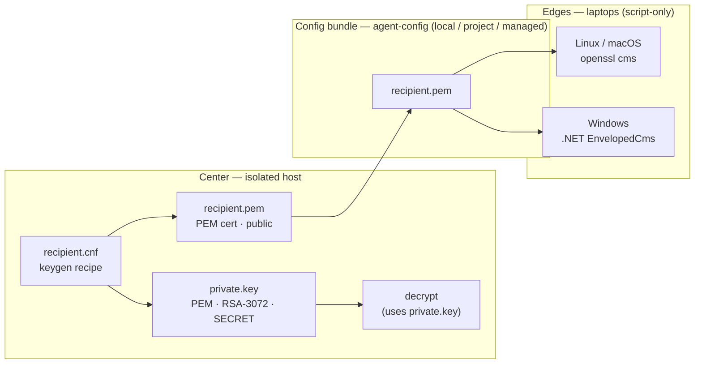
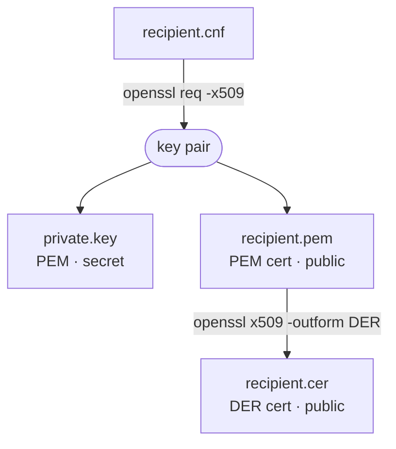
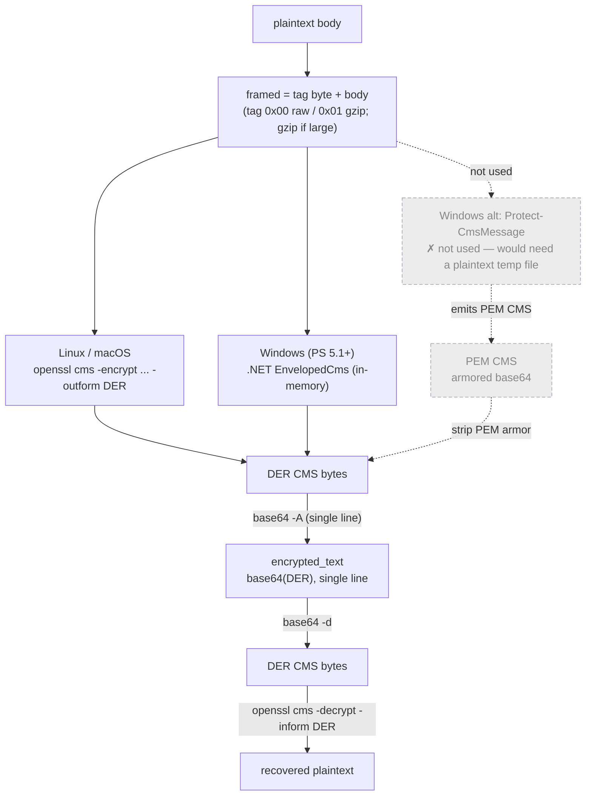

# Edge content-sealing — center utilities

This directory holds the **center-side** (operator) tooling for the agent-audit
content-sealing feature: key issuance and decryption.

Sealing is **opt-in and off by default**. With no configuration, every `-audit` stack
captures `content=plaintext` and has zero crypto dependencies. A stack opts in by
setting `capture.<stream>.content=encrypted` and `seal.epoch=<epoch>`, which selects the
recipient issued under `recipients/<epoch>/`. `seal.recipients_file` optionally overrides
the cert path.

---

## 1. Trust boundary — who holds what, what gets distributed



Note what is **absent**: there is no arrow from `private.key` to the config bundle or
to any edge. The private key only ever flows into the local decrypt step. A fully
compromised laptop yields only a public recipient — which can seal, never open.

---

## 2. The files

| File | Format | Holds | Lives | Distributed to edge? |
| --- | --- | --- | --- | --- |
| `recipient.cnf` | OpenSSL config (text) | keygen recipe (DN, keyUsage, EKU, SKI) | center | no |
| `private.key` | PEM | RSA-3072 **private** key | **center only** | **never** |
| `recipient.pem` | PEM (`-----BEGIN CERTIFICATE-----`) | public cert | center → bundle | yes — every edge (Linux / macOS / Windows) |
| `recipient.cer` | DER (binary) | public cert (same key as `.pem`) | center | no — legacy, only for the Protect-CmsMessage aside (§5) |
| `encrypted_text` | text: `base64(DER)`, single line | one sealed body | Elasticsearch field | n/a — this *is* the stored value |
| `seal.key_id` | keyword (text) | rotation epoch tag (e.g. `2026Q3`) | Elasticsearch field, **cleartext** | n/a |

The seal path uses **`recipient.pem` on every edge** — both `openssl cms` and .NET
`EnvelopedCms` read PEM. `recipient.cer` is the same key in DER, kept only for the
Protect-CmsMessage aside (§5); it is not distributed.

---

## 3. Format transformations (and the commands that do them)



```bash
# Issue an epoch keypair (center). recipient.cnf sets RSA-3072, keyUsage=keyEncipherment,
# EKU 1.3.6.1.4.1.311.80.1 (Document Encryption — required by Protect-CmsMessage), and a SKI.
openssl req -x509 -newkey rsa:3072 -keyout private.key -nodes -days 1825 \
  -out recipient.pem -config recipient.cnf

# Optional: PEM -> DER, only for the Protect-CmsMessage aside (§5). The seal path uses
# recipient.pem on every edge (EnvelopedCms reads PEM), so DER is not required.
openssl x509 -in recipient.pem -outform DER -out recipient.cer
```

---

## 4. Seal paths differ by OS — but they converge to one stored form and one decrypt path

Each OS seals with its own tool from the **same `recipient.pem`**, and both emit **DER
directly**, converging on one canonical field — single-line `base64(DER)` — so the center
always decrypts the same way.



The field must be newline-free: a single stray newline trips the `dynamic:strict` mapping,
which the fail-open hook silently drops.

The Windows edge uses **.NET `EnvelopedCms`** (the `System.Security` assembly, present on
stock Windows including PS 5.1 — no developer tools), not `Protect-CmsMessage`. The cmdlet
used in the hands-on walkthrough can only seal a *string* or a *file path*, so sealing the
binary framing through it would force a **plaintext temp file on disk**. `EnvelopedCms`
seals the bytes in memory and returns DER, avoiding both — verified on PS 5.1 and 7. It
also **reads `recipient.pem` (PEM) directly**, so every edge uses the same PEM cert and the
old per-OS DER (`recipient.cer`) need — which came from `Protect-CmsMessage` — no longer applies.

### OS matrix

| OS | Edge tool | Reads public cert as | Seal output | Caveats |
| --- | --- | --- | --- | --- |
| Linux | `openssl` 3.x, `cms` subcommand | `recipient.pem` (PEM) | DER | — |
| macOS | stock `/usr/bin/openssl` (LibreSSL) | `recipient.pem` (PEM), from file | DER | use `cms`, **not** `smime`; RSA recipient only (LibreSSL `cms` mishandles EC) |
| Windows | .NET `EnvelopedCms` (`System.Security`) | `recipient.pem` (PEM) | DER | `EnvelopedCms` reads PEM (verified PS 5.1 & 7), so no DER needed; `Protect-CmsMessage` not used (would need a plaintext temp file) |

Key asymmetry to remember: **encoding matters only on the seal side** (it reads the
public cert). **Decryption is driven by `private.key`** — the `-recip` cert there is only a
selector, so its encoding is irrelevant.

---

## 5. Command reference

```bash
# --- SEAL: Linux / macOS edge (public key only) ---
{ printf '\x00'; cat body.txt; } \
  | openssl cms -encrypt -aes256 -recip recipient.pem -binary -outform DER \
  | base64 | tr -d '\n'                 # -> encrypted_text value

# --- SEAL: Windows edge (public key only) ---
# .NET EnvelopedCms in PowerShell — in-memory, emits DER directly. See seal.ps1.

# --- LEARNING ASIDE: Protect-CmsMessage (NOT used by the edge) ---
# Protect-CmsMessage -To .\recipient.cer -Path .\framed.bin   # emits PEM CMS;
# strip the armor to recover the same base64(DER):
#   grep -v -- '-----' sealed.pem | tr -d '\n'   # == base64(DER)
# Avoided in production because -Path puts plaintext on disk.

# --- DECRYPT: center (uniform, regardless of which edge sealed it) ---
printf '%s' "$encrypted_text" | base64 -d \
  | openssl cms -decrypt -inform DER -recip recipient.pem -inkey private.key -binary
# tag byte: 0x00 -> use body as-is; 0x01 -> gunzip the remainder
```

---

## 6. Size & compression characteristics

A sealed field costs a **fixed ~565 B of DER overhead** (RSA-3072-wrapped AES key +
IV + ASN.1 structure, independent of body size) plus the body itself, then ×4/3 for
base64. The framing tag (§4) optionally gzips the body first (`seal.compress_min_bytes`
gates this). Because gzip runs *before* encryption, a large prompt's stored
`encrypted_text` can end up **smaller than the plaintext** — unusual for
encrypt-then-base64, which normally only inflates.

Measured on a realistic corpus (this repo's own shell/markdown source — mixed code,
config, and prose; RSA-3072 recipient, AES-256-CBC, gzip -6). `b64 raw` / `b64 gz` are
the stored `encrypted_text` character counts without / with the gzip framing path:

| body | gz % | `b64 raw` | `b64 gz` | saved by gzip |
| ---: | ---: | ---: | ---: | ---: |
|  64 B | 128 % |    852 |   876 | **−3 %** |
| 128 B | 102 % |    940 |   940 | **0 %** |
| 256 B |  87 % |  1,112 | 1,048 | **+6 %** |
| 512 B |  70 % |  1,456 | 1,240 | **+15 %** |
|  1 kB |  54 % |  2,136 | 1,496 | **+30 %** |
|  2 kB |  46 % |  3,504 | 2,008 | **+43 %** |
|  4 kB |  36 % |  6,232 | 2,736 | **+56 %** |
|  8 kB |  32 % | 11,696 | 4,228 | **+64 %** |
| 16 kB |  29 % | 22,616 | 7,024 | **+69 %** |

```
saved by gzip on stored encrypted_text   (negative = gzip made it bigger)
 64 B ┤▏                             −3 %   gzip expands — never compress
128 B ┤▏                              0 %   break-even
256 B ┤██▍                          +6 %
512 B ┤██████                      +15 %
 1 kB ┤████████████                +30 %
 2 kB ┤█████████████████▏          +43 %
 4 kB ┤██████████████████████▍     +56 %
 8 kB ┤█████████████████████████▌  +64 %
16 kB ┤███████████████████████████▌+69 %
      └────┬────┬────┬────┬────┬────┬
          10   20   30   40   50   60 %
```

Savings rise with size because the fixed ~565 B overhead is amortized over a larger
body. The **break-even is ~128–256 B** of realistic text: below ~128 B gzip cannot beat
its own ~18 B header and the stored field grows (64 B → −3 %); incompressible bodies
(random, already-base64) never benefit at any size. This is what `seal.compress_min_bytes`
guards (template default 512 B).

---

## 7. Planned layout (scaffolded incrementally)

```
sealing/
  README.md                      # this file
  .gitignore                     # ignore private/ and recipients/ (generated key material)
  recipient.cnf                  # OpenSSL recipe for the recipient cert (epoch via $ENV::SEAL_EPOCH)
  scripts/
    new-recipient.sh             # issue an epoch keypair
    decrypt.sh                   # base64 -> DER -> openssl cms -decrypt, try each epoch key
  recipients/<epoch>/            # generated PUBLIC certs; recipient.pem is the seal cert (.cer is legacy)
  private/<epoch>/               # generated PRIVATE key (private.key) — guarded at the center, never distributed
```
