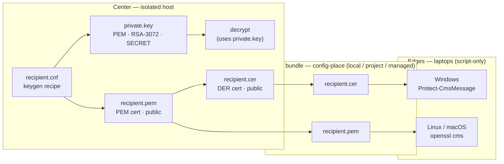
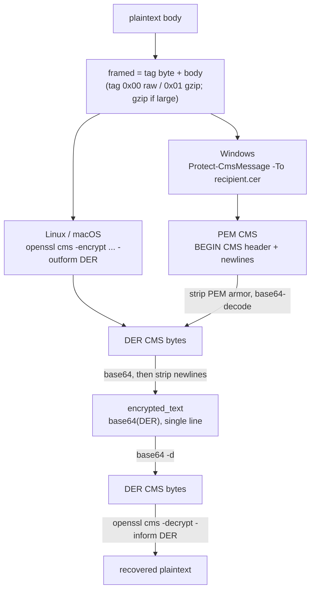

# Edge content-sealing — center utilities

This directory holds the **center-side** (operator) tooling for the agent-audit
content-sealing feature: key issuance and decryption.

Sealing is **opt-in and off by default**. With no configuration, every `-audit` stack
captures `content=plaintext` and has zero crypto dependencies. A stack opts in by
setting `capture.<stream>.content=encrypted` and pointing `seal.recipients_file` at a
distributed public recipient (see `SPEC/config-deployment.md` once written).

---

## 1. Trust boundary — who holds what, what gets distributed



Note what is **absent**: there is no arrow from `private.key` to the config bundle or
to any edge. The private key only ever flows into the local decrypt step. A fully
compromised laptop yields only a public recipient — which can seal, never open.

---

## 2. The files

| File | Format | Holds | Lives | Distributed to edge? |
| --- | --- | --- | --- | --- |
| `recipient.cnf` | OpenSSL config (text) | keygen recipe (DN, keyUsage, EKU, SKI) | center | no |
| `private.key` | PEM | RSA-3072 **private** key | **center only** | **never** |
| `recipient.pem` | PEM (`-----BEGIN CERTIFICATE-----`) | public cert | center → bundle | yes — Linux / macOS edges |
| `recipient.cer` | DER (binary) | public cert (same key as `.pem`) | center → bundle | yes — Windows edges |
| `encrypted_text` | text: `base64(DER)`, single line | one sealed body | Elasticsearch field | n/a — this *is* the stored value |
| `seal.key_id` | keyword (text) | rotation epoch tag (e.g. `2026Q3`) | Elasticsearch field, **cleartext** | n/a |

`recipient.pem` and `recipient.cer` are the **same public key in two encodings** —
PEM is `base64(DER)` wrapped in header lines; DER is the raw binary. See §3.

---

## 3. Format transformations (and the commands that do them)


```bash
# Issue an epoch keypair (center). recipient.cnf sets RSA-3072, keyUsage=keyEncipherment,
# EKU 1.3.6.1.4.1.311.80.1 (Document Encryption — required by Protect-CmsMessage), and a SKI.
openssl req -x509 -newkey rsa:3072 -keyout private.key -nodes -days 1825 \
  -out recipient.pem -config recipient.cnf

# PEM cert -> DER cert, for the Windows edge (Protect-CmsMessage -To wants DER, esp. on PS 5.1)
openssl x509 -in recipient.pem -outform DER -out recipient.cer
```

---

## 4. Seal paths differ by OS — but they converge to one stored form and one decrypt path

Each edge seals with whatever ships on its OS, producing a *different on-the-wire
shape*. The edge then **normalizes to a single canonical field**, so the center always
decrypts the same way. Normalization is at seal time, never a branch at decrypt time.



Why single-line `base64(DER)` is the canonical form (not PEM): PEM carries header lines
and embedded newlines, and a single stray newline in the field trips the `dynamic:strict`
mapping, which the fail-open hook silently drops. So the field must be newline-free; the
Windows edge converts its PEM CMS back to the same DER bytes, then base64s them
single-line — converging with the openssl route.

### OS matrix

| OS | Edge tool | Reads public cert as | Seal output | Caveats |
| --- | --- | --- | --- | --- |
| Linux | `openssl` 3.x, `cms` subcommand | `recipient.pem` (PEM) | DER | — |
| macOS | stock `/usr/bin/openssl` (LibreSSL) | `recipient.pem` (PEM), from file | DER | use `cms`, **not** `smime`; RSA recipient only (LibreSSL `cms` mishandles EC) |
| Windows | PowerShell `Protect-CmsMessage` | `recipient.cer` (**DER**) | PEM CMS | cert must carry the Document-Encryption EKU; host verified on PS 7.6.3 — **re-confirm on PS 5.1** (fleet target) |

Key asymmetry to remember: **encoding matters only on the seal side** (it reads the
public cert; openssl=PEM, Windows=DER). **Decryption is driven by `private.key`** — the
`-recip` cert there is only a selector, so its encoding is irrelevant.

---

## 5. Command reference

```bash
# --- SEAL: Linux / macOS edge (public key only) ---
{ printf '\x00'; cat body.txt; } \
  | openssl cms -encrypt -aes256 -recip recipient.pem -binary -outform DER \
  | base64 | tr -d '\n'                 # -> encrypted_text value

# --- SEAL: Windows edge (public key only) ---
# Protect-CmsMessage -To .\recipient.cer -Path .\framed.bin   # emits PEM CMS;
# then: strip '-----' lines and join -> base64(DER) single line

# --- NORMALIZE a PEM CMS to the canonical field (proves equivalence) ---
grep -v -- '-----' sealed.pem | tr -d '\n'        # == base64(DER)

# --- DECRYPT: center (uniform, regardless of which edge sealed it) ---
printf '%s' "$encrypted_text" | base64 -d \
  | openssl cms -decrypt -inform DER -recip recipient.pem -inkey private.key -binary
# tag byte: 0x00 -> use body as-is; 0x01 -> gunzip the remainder
```

---

## 6. Planned layout (scaffolded incrementally)

```
sealing/
  README.md                      # this file
  .gitignore                     # ignore private/ and recipients/ (generated key material)
  recipient.cnf                  # OpenSSL recipe for the recipient cert (epoch via $ENV::SEAL_EPOCH)
  scripts/
    new-recipient.sh             # issue an epoch keypair
    decrypt.sh                   # base64 -> DER -> openssl cms -decrypt, try each epoch key (planned)
  recipients/<epoch>/            # generated PUBLIC certs (recipient.pem / .cer), staged for distribution
  private/<epoch>/               # generated PRIVATE key (private.key) — guarded at the center, never distributed
```
